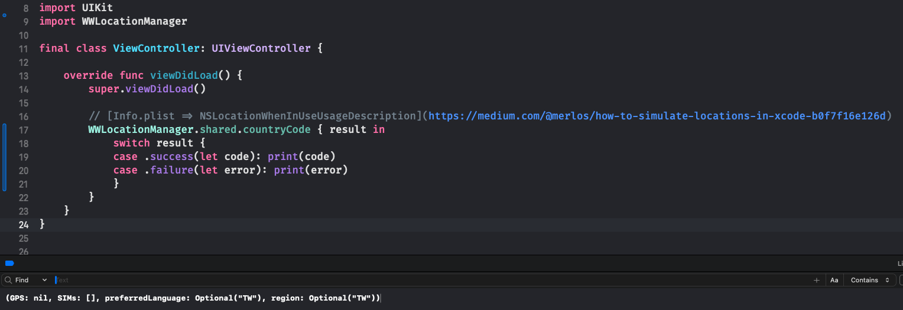

# WWLocationManager

[](https://developer.apple.com/swift/) [](https://developer.apple.com/swift/)  [](https://developer.apple.com/swift/) [](https://developer.apple.com/swift/)

## [Introduction - 簡介](https://swiftpackageindex.com/William-Weng)
- Find location-related settings on your phone. (Region / Language / SIM / GPS)
- 找出手機上跟地點相關的設定。 (地區 / 語系 / SIM / GPS定位)
- [Teaching - 設計教學](https://william-weng.github.io/2021/05/swift-5我到底身在何方我到底去到何處/)

## [Achievements display - 成果展示](https://www.hkweb.com.hk/blog/ui設計基礎知識：引導頁對ui設計到底有什麼作用/)


## [Installation with Swift Package Manager - 安裝方式](https://medium.com/彼得潘的-swift-ios-app-開發問題解答集/使用-spm-安裝第三方套件-xcode-11-新功能-2c4ffcf85b4b)

```bash
dependencies: [
    .package(url: "https://github.com/William-Weng/WWLocationManager.git", .upToNextMajor(from: "1.0.0"))
]
```

## Function - 可用函式

|函式|功能|
|-|-|
|countryCode(isAlways:result:failure:)|取得有關所在位置的資訊 (Info.plist => NSLocationWhenInUseUsageDescription)|
|close()|關閉定位|

## Example - 程式範例
```swift
import UIKit
import WWPrint
import WWLocationManager

final class ViewController: UIViewController {

    override func viewDidLoad() {
        super.viewDidLoad()
        
        WWLocationManager.shared.countryCode { code in
            wwPrint(code)
        } failure: { error in
            wwPrint(error)
        }
    }
}
```
